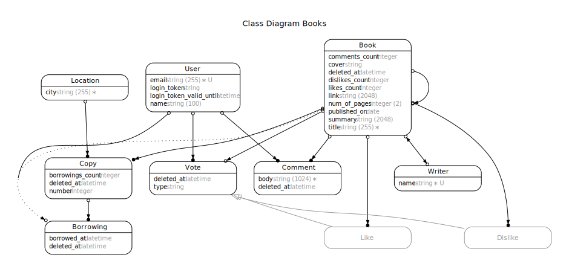

# Books

## Introduction

...

## Installation

- Install [all requirements](https://gorails.com/setup/osx/10.15-catalina) on your machine
- `brew install imagemagick`
- `git clone <repository-url>` this repository
- `cd books`
- `bundle install`
- `bin/rails db:setup`

## Running / Development

- `bin/rails s`
- Visit your app at [http://localhost:3000](http://localhost:3000).

### Populate the database

The project comes with a `seed.rb` which you can use to populate your development environment:

`bin/rails db:seed [USERS_COUNT=n] [BOOKS_COUNT=m]`

## Technical details

### Daemonite's Material UI

Since I never used [Material Design](https://material.io/) before, I thought this project would make a good candidate. For this I used [Daemonite's Material UI](http://daemonite.github.io/material/), which uses Bootstrap with some customizations added to it. Instructions on how to use Daemonite's Material UI in a Rails project can be found [here](https://gist.github.com/bazzel/0226bf815c9018388ae2e7e3bc438c57).

### Class diagram

To update the diagram, run the following command:

`bin/rails erd`

### SendGrid

The production version of this application uses [SendGrid](http://sendgrid.com) for sending mails.

### S3

In [some environments](config/initializers/carrierwave.rb) images are uploaded to an S3 bucke using [CarrierWave](https://github.com/carrierwaveuploader/carrierwave). If you want to use this feature, make sure you have an S3 bucket created and add the required keys to the corresponding ENV variables:

* `AWS_ACCESS_KEY_ID`
* `AWS_SECRET_ACCESS_KEY`
* `AWS_REGION`
* `AWS_BUCKET_NAME`

### Fallback cover image

Generated using [https://dummyimage.com/200x300/212121/fafafa.png&text=No+Cover+Available](https://dummyimage.com/200x300/212121/fafafa.png&text=No+Cover+Available)

## Deployment

The application is hosted by Heroku ([staging](https://thawing-badlands-71406.herokuapp.com) and [production](https://books.kabisa.nl)). Instruction about the deployment process can be found [here](https://devcenter.heroku.com/articles/getting-started-with-rails5).
